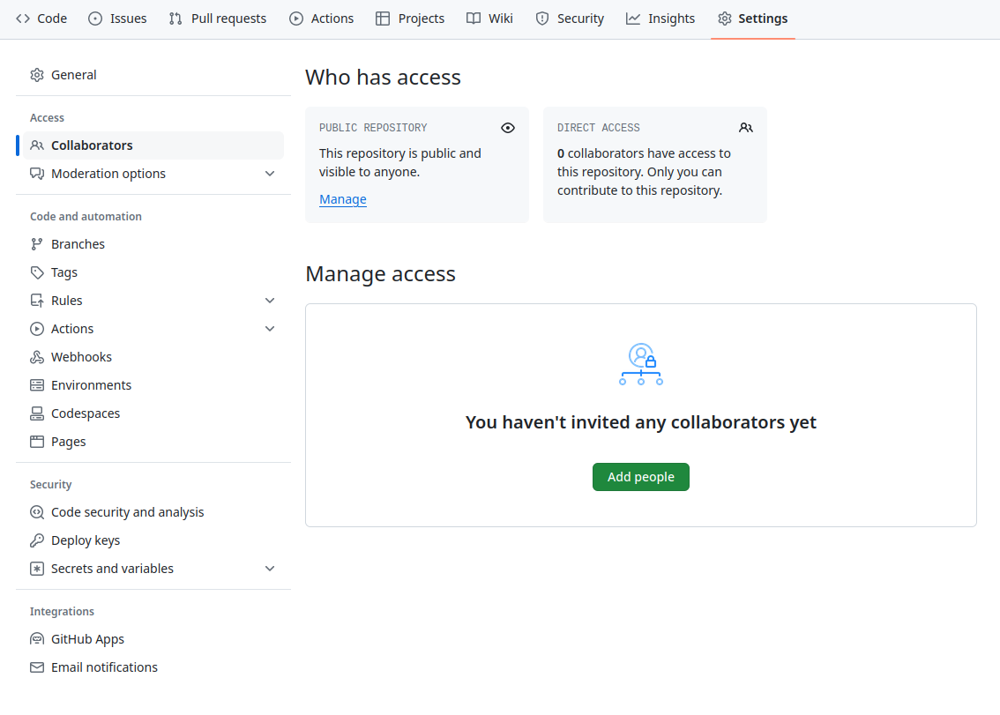
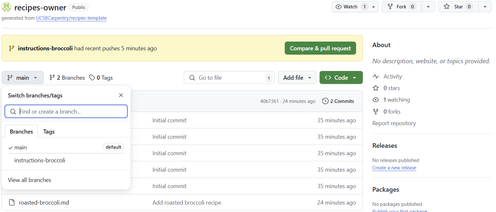
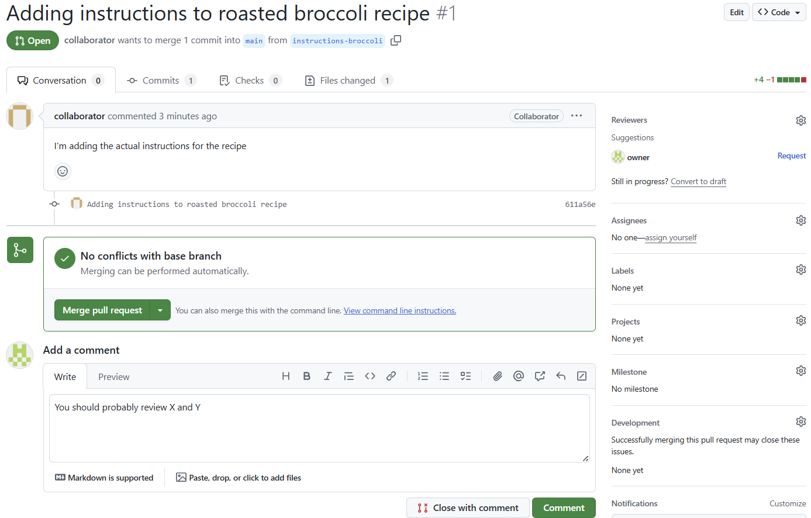

::::::::::::::::::::::::::::::::::::::: objectives

- Explain what branches are and how they could be used.
- Learn how to merge branches, both in Git and GitHub.
- Introduce the concept of Pull Request.

::::::::::::::::::::::::::::::::::::::::::::::::::

:::::::::::::::::::::::::::::::::::::::: questions

- What is a branch in a Git repository?
- Why are branches useful?
- How can I merge different branches?

::::::::::::::::::::::::::::::::::::::::::::::::::

At the start of the lesson we configured the default branch to be called 'main'. Maybe you've noticed some of the messages from Git say 'On branch main'. So probably you're wondering, what is a branch?

So far we have only used a sequential timeline with Git: each change builds on the one before, and only on the one before. However, there are times when we want to try things out without disrupting our main work. 
To do this, we can use branches to work on separate tasks in parallel. Each branch is a parallel timeline, a snapshot; changes made on the branch only affect that branch unless and until we explicitly combine them with work done in another branch.

We can see what branches exist in a repository using this command:

```bash
$ git branch
```

```output
* main
```

By default, Git automatically creates a branch called 'master' when we initialize a repository. We changed this default name to 'main' when we ran the command '$ git config --global init.defaultBranch main', and we did this to match the default branch name in GitHub.

The main (or master) branch is often considered the “official” version of the repository. The asterisk * indicates that it is currently active, i.e., that all changes we make will take place in this branch by default (the active branch is like the current working directory in the shell.)

:::::::::::::::::::::::::::::::::::::::::: spoiler

### Default branch name on GitHub

In mid-2020, GitHub changed the name of the default branch (the first branch created when a repository is initialized) from “master” to “main.” Owners of repositories may also change the name of the default branch. This means that the name of the default branch may be different among repositories based on when and where it was created, as well as who manages it.

::::::::::::::::::::::::::::::::::::::::::::::::::

## 1\. Creating a branch

We'll add a new recipe for roasted broccoli. But while we work on writing it, we don't want it to be part of our main cookbook. For this, we'll create a new branch called 'broccoli'.


```bash
$ git branch broccoli
```

It's important to note that the 'broccoli' branch was created from the branch we were in (i.e.'main',) and until we've committed any changes, both branches are identical.

As before, we can see the branches in our repository with:
```bash
$ git branch
```

```output
  broccoli
* main  
```

'main' is still active, so any changes we make are going to be applied to that branch. We can can switch to our new branch using:
```bash
$ git switch broccoli
```

```output
Switched to branch 'broccoli'
```

:::::::::::::::::::::::::::::::::::::::::: spoiler

### Reduce the typing to create and swith to a branch

Instead of typing `branch` first and then `switch`, we can create a new branch using the '-c' option of the switch command (short for --create,) like this:

```bash
$ git switch -c new-broccoli
```
```output
Switched to branch 'new-broccoli'
```

Switch is a relatively new command, included in 2019 with Git 2.23. Previously, the command 
for creating and switching to another branch would be `checkout`. So if you search online, 
or if you ask a colleague that uses Git, maybe they would tell you to use 'checkout', like 
the following command shows. However, the newer command `switch` makes it easier to remember what we want to do!
```bash
$ git checkout -b new-broccoli
```

::::::::::::::::::::::::::::::::::::::::::::::::::

## 2\. Making changes and comparing our snapshots

Once more, we can check what branch are we working on with:

```bash
$ git branch
```

```output
* broccoli
  main
```

Now that we are sure we are in the branch we want, we can start making changes. Let's create
a new file, called 'roasted-broccoli.md', to write our recipe.
```bash
$ nano roasted-broccoli.md
```

Type the text below into the `roasted-broccoli.md` file:

```output
# Roasted Broccoli
## Ingredients
* broccoli
* olive oil
* salt
```

Save and close the file. Then we can add this new recipe to the staging area and 
commit as usual.

```bash
$ git add roasted-broccoli.md
$ git commit -m "Add roasted broccoli recipe"
```

```output
[broccoli 063c431] Add roasted broccoli recipe
 1 file changed, 5 insertions(+)
 create mode 100644 roasted-broccoli.md
```

We now can see a graphical representation of the history of our repository and
how each branch is a different snapshot of our repository:

```bash
$ git log --all --graph
```

Even more, if we compare the files in our repository when we switch branches,
we can even see our 'roasted-broccoli.md' recipe doesn't even appear in our file system
when we are in the 'main' branch!

```bash
$ ls
```
```output
cakes/  groceries.md  guacamole.md  ketchup.md  roasted-broccoli.md
```

```bash
$ git switch main
$ ls
```
```output
Switched to branch 'main'
Your branch is up to date with 'origin/main'.

cakes/  groceries.md  guacamole.md  ketchup.md
```

Isn't that amazing?! Each branch is a completely different snapshot of our repository!


## 3\. Merging

We decided our recipe is finished and ready to be integrated to our 'main' cookbook.
To do this, we'll merge the 'broccoli' branch into 'main' (that’s how Git calls 
integrating changes between branches, merging.) For this, we first need to make sure
we are in the 'main' branch, and if not, switch to it.

```bash
$ git branch
```
```output
  broccoli
* main
```

When we are in 'main', we merge 'broccoli' like this:
```bash
$ git merge broccoli
```
```output
Updating 971395c..ce0df55
Fast-forward
 roasted-broccoli.md | 5 +++++
 1 file changed, 5 insertions(+)
 create mode 100644 roasted-broccoli.md
```

After merging, the 'broccoli' branch is no longer useful and we can delete it.

```bash
$ git branch -d broccoli
```
```output
Deleted branch broccoli (was ce0df55).
```

And finally, we can push our changes to our remote GitHub repo. 

```bash
$ git push origin main
```

## 4\. Collaborating with branches

We now know what branches are, how they can be useful, and to use them with the 
'branch', 'switch', and 'merge' commands. But this has not been a collaborative workflow, as 
all changes were made and merged in our local repo. 

In this section we'll learn how to push a branch to GitHub, and let other people
review and comment on our work, before it's merged to the 'main' cookbook. We'll work
in pairs, and once again one person is the 'Collaborator', who makes the changes,
and the other person is the 'Owner'. So make sure the Owner gives access to 
their repo to the Collaborator, like explained in [Episode 11. Collaborating](./08-collab.html).

{alt='A screenshot of the GitHub Collaborators settings page, which is accessed by clicking "Settings" then "Collaborators"'}

The Collaborator will clone the Owner's repo into their `Desktop` folder

```bash
$ git clone git@github.com:owner/recipes-owner.git ~/Desktop/recipes-owner
$ cd ~/Desktop/recipes-owner
```
We can check that changes the Collaborator pushes to GitHub will go directly to
the repository of the owner, using the 'remote' command

```bash
$ git remote -v
```
```output
origin  git@github.com:owner/recipes-owner.git (fetch)
origin  git@github.com:owner/recipes-owner.git (push)
```

In their local repo, the Collaborator creates a new branch called 'add-tomato-to-guac'

```bash
$ git switch -c instr-broccoli
```
```output
Switched to a new branch 'instr-broccoli'
```

Then the Collaborator modifies the 'roasted-broccoli.md' recipe, like this
```output
# Roasted Broccoli
## Ingredients
* broccoli
* olive oil
* salt
## Instructions
* Toss broccoli with olive oil and salt.
* Roast at 425°F for 20 minutes.
```

As usual, we add the desired files to the staging area and commit
```bash
$ git add roasted-broccoli.md
$ git commit -m "Adding instructions to roasted broccoli recipe"
```
```output
[instr-broccoli 611a56e] Adding instructions to roasted broccoli recipe
 1 file changed, 4 insertions(+), 1 deletion(-)
```

As we've got the practice, we now push our changes to the remote repo on GitHub.
The only changes we need to make in the command is that we need to push our new
branch 'instr-broccoli', instead of the usual 'main'.

```bash
$ git push origin instr-broccoli
```
```output
Enumerating objects: 5, done.
Counting objects: 100% (5/5), done.
Delta compression using up to 20 threads
Compressing objects: 100% (3/3), done.
Writing objects: 100% (3/3), 400 bytes | 400.00 KiB/s, done.
Total 3 (delta 1), reused 0 (delta 0), pack-reused 0 (from 0)
remote: Resolving deltas: 100% (1/1), completed with 1 local object.
remote:
remote: Create a pull request for 'instr-broccoli' on GitHub by visiting:
remote:      https://github.com/owner/recipes-owner/pull/new/instr-broccoli
remote:
To github.com:owner/recipes-owner.git
 * [new branch]      instr-broccoli -> instr-broccoli
```

If they visit the GitHub repo for recipes-owner, both the Owner and the Collaborator
will see a new message at the top saying "instr-broccoli had recent pushes 
x minutes ago [Compare and pull request]". 

{alt='A screenshot of the GitHub repo from the Collaborators profile'}


Here is a new concept, what is a pull request? As [GitHub defines it](https://docs.github.com/en/pull-requests/collaborating-with-pull-requests/proposing-changes-to-your-work-with-pull-requests/about-pull-requests#about-pull-requests)
, "A pull request is a proposal to merge a set of changes from one branch into 
another. In a pull request, collaborators can review and discuss the proposed set 
of changes before they integrate the changes into the main codebase".

Being able to review and discuss changes is really useful! The Collaborator now clicks
the button "Compare & pull request". In the "Open a pull request" page we can that
we are proposing a merge into 'main' from the 'instr-broccoli' branch, and if we
scroll down, we can also see the Collaborator's commit and the diff with the changes made.
As we see, the Collaborator can add a title and a description for the suggested changes,
and then click the "Create pull request" button.

Then GitHub takes us to the pull request, where the Owner, the Collaborator, or any
other person can see the commits included in the pull request, what files have changed,
add comments to the discussion, close the pull request without merging changes, or 
merge the pull request (which would merge the 'instr-broccoli' branch into 'main').

{alt='A screenshot of the GitHub repo from the Collaborators profile'}


:::::::::::::::::::::::::::::::::::::::  challenge

## Adding changes to a branch with a pull request open

When we have a pull request, one option is to directly merge the suggested changes.
But what if we need to modify something on top of the suggested changes? Let's say
the Owner wants to add a final instruction step, which says "* Serve".

For this challenge, the Owner will pull the 'instr-broccoli' into their local repo,
modify the file to add the "* Serve" step, and push the changes to the GitHub repo. Then,
Owner will make a final comment and merge the pull request.

Discuss with your partner how this process looks in the previous pull request.

Hint: For the Owner's local repo, the 'instr-broccoli' is an untracked branch,
as it doesn't exist in their local repo. We can see this with the commands

```bash
$ git branch -v
$ git branch -r
```

Therefore the Owner needs to create a new local branch (ideally called the same as
the remote branch) and track that remote branch, like this

```bash
$ git switch -c instr-broccoli origin/instr-broccoli
```

::::::::::::::::::::::::::::::::::::::::::::::::::


:::::::::::::::::::::::::::::::::::::::: keypoints

- Branches allow parallel work without affecting the main codebase.

- Each branch is a parallel snapshot. Changes are isolated until merged.

- Use `git branch`, `git switch`, and `git merge` to manage branches.

- Merging integrates changes from one branch into another.

- Use `git push origin branch-name` to share a branch on GitHub.

- Pull requests enable code review and discussion before merging.

::::::::::::::::::::::::::::::::::::::::::::::::::
